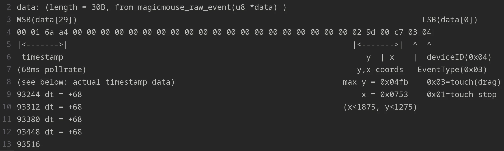
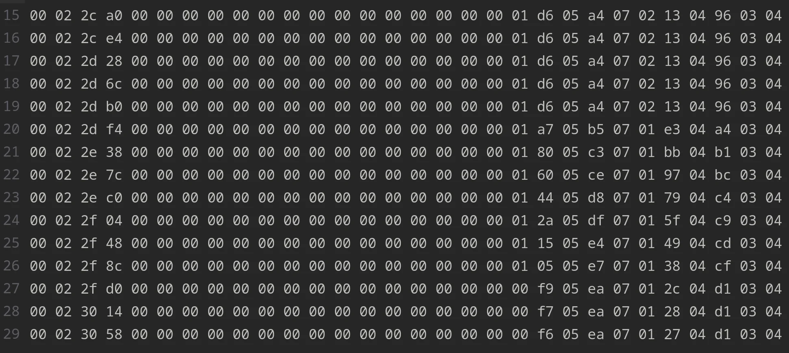

# Ansible Role "touchpad"

> Setup touchpad devices

## Resources

### Official

- site:
- repo:
- docs:

### Additional

#### Original post: [A better way of getting Bosto touchpad working](https://www.reddit.com/r/Fedora/comments/1b901w1/a_better_way_of_getting_bosto_touchpad_working/)

> This post is an update to my original post about getting the Bosto touchpad working in Fedora. TLDR: Bought touchpad,
> didn't work, apparently have to reload hid-magicmouse, thus recompile kernel because Fedora kernels have them as
> builtin modules.
>
> Even though I got the touchpad working by building kernel that has hid-magicmouse as a loadable kernel module(that is,
> not builtin), that is not a sustainable solution. Compiling a kernel is no joke, and I even had to revert some BIOS
> settings to get my computer to compile without crashing! Obviously, I needed a more elegant solution. To those not
> interested in hearing my life story, behold:

```sh
# /etc/udev/rules.d/99-bostotouch.rules
# 2024 March 07, u/NonStandardUser
# No tinkering required, just add this rule to udev.

KERNEL=="0003:05AC:0265.*", \
PROGRAM="/bin/sh -c 'echo -n %k > /sys/bus/hid/drivers/magicmouse/unbind;\
echo -n %k > /sys/bus/hid/drivers/hid-multitouch/bind'"
If you're not too keen on reading long paragraphs, you can stop here.
```

> Now for those interested in the specifics on how I was able to create this, I first dived in the hid-magicmouse driver
> code to see exactly what is going wrong. evemu-record shows that ABS_X, ABS_Y data were being reported properly, why
> is it not converted into proper events (e.g. ABS_MT_POSITION, MSC_TIMESTAMP)? I copied the code, renamed it, and
> installed it using dkms. Getting dkms to work in itself was one hell of a chore.
>
> But this damn touchpad has the USB PID/VID of Apple's Magic Trackpad 2. So, when I plug it in, the kernel assigns
> hid-magicmouse to it automatically. How do I get it to use my test driver? Apparently, by using udev rules! sysfs
> exposes driver bind and unbind functions for devices, and this udev rule takes advantage of that by 1) unbinding
> device from default driver and 2) binding to target driver whenever it is triggered with a specific device name. This
> means that you can override drivers with this single line of code! Neat.
>
> So there I am, now with the ability to dynamically install, load and unload my driver as I please, logging info using
> printk and whatnot. Soon, I realize something is amiss. The raw data that the driver is handling doesn't fit the
> expected format at all. Bits that should contain info like tracking index are all zeros. I only get the timestamp, X
> and Y coords, device type and event type.
>
> 
> At this point I was super frustrated, rebooting and hopping back and forth between my 'production' boot drive and this
> test install, trying to see what discrepancies there are in the evemu-record logs. Then, something magical happened:
> The touchpad suddenly started working on my test boot drive. This was bad, actually; I didn't do anything, why are you
> working?? Little did I know that this would ultimately solve the case.
>
> Digging into dmesg, I saw that for some reason(I still don't know the cause; maybe my driver crashed, somehow?),
> hid-multitouch took control over the touchpad instead of my driver. Upon disconnecting and reconnecting the touchpad,
> my driver took control again per the udev rule, and it stopped working again; only this time, I saw that the raw data
> contained a lot more info. That was what I was missing; and yet, even with this additional data, the driver still
> couldn't handle it because it was not in the expected format.
>
> 
> That didn't matter anymore, however. hid-multitouch works?? Hope became reality as I edited the udev rule to have the
> device bound to hid-multitouch, not hid-magicmouse nor my driver. That is how this fix came to be, and I stopped
> there. I didn't examine hid-multitouch, but whatever, the thing works now. Maybe later.
>
> I don't know if anyone's still with me here, but kudos to those who are. I just wanted to get my experience out there;
> share what I learned. And Learned I did! From sysfs bind/unbind and using udev, building and installing modules
> through makefile and dkms, and finally examining raw data using a custom kernel module, I went to hell and back with
> this one. And even though I didn't get to use my custom kernel module, I'd say it was worth it, because without that
> effort I wouldn't have discovered the udev rule and hid-multitouch.
>
> I had tons of fun(haha im in pain) and I encourage anyone to do similar things and share them with people. Thanks for
> reading.

## Requirements

Any pre-requisites that may not be covered by Ansible itself or the role should be mentioned here. For instance, if the
role uses the EC2 module, it may be a good idea to mention in this section that the boto package is required.

## Role Variables

A description of the settable variables for this role should go here, including any variables that are in
defaults/main.yml, vars/main.yml, and any variables that can/should be set via parameters to the role. Any variables
that are read from other roles and/or the global scope (ie. hostvars, group vars, etc.) should be mentioned here as
well.

## Dependencies

A list of other roles hosted on Galaxy should go here, plus any details in regards to parameters that may need to be set
for other roles, or variables that are used from other roles.

## Example Playbook

Including an example of how to use your role (for instance, with variables passed in as parameters) is always nice for
users too:

```yaml
- name: Apply touchpad configuration to local node
  hosts: localhost
  roles:
    - role: arcfg.hardware.touchpad
```

```yaml
- name: Apply touchpad configuration to local node
  hosts: localhost
  roles:
    - role: arcfg.hardware.touchpad
      tags:
        - laptop
        - desktop
```
